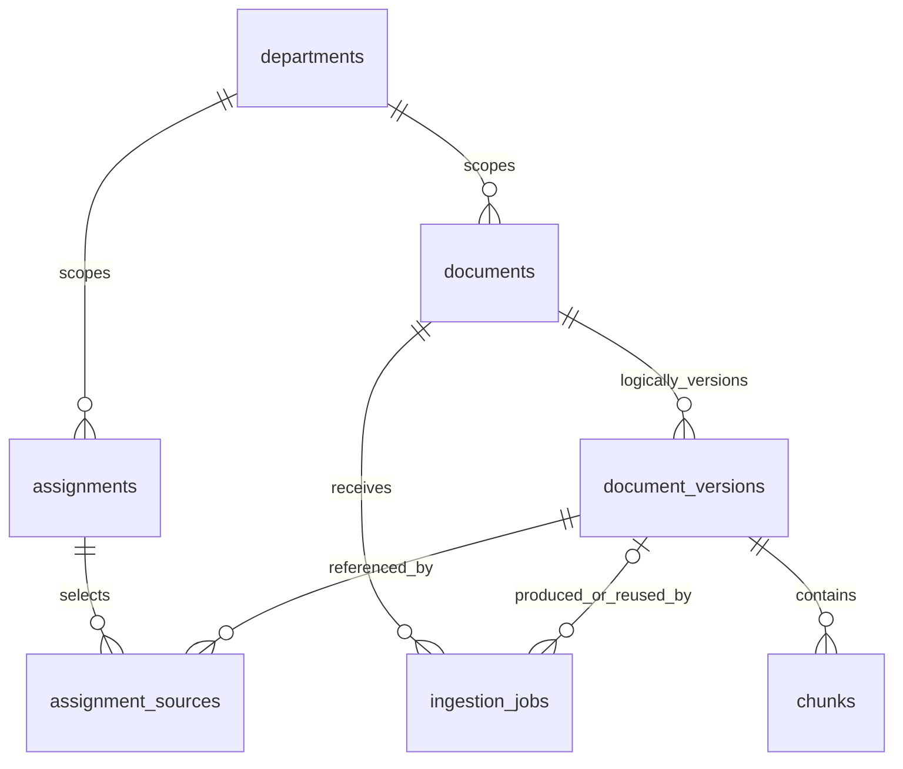

# Data storage and relationships

[Handbook home](README.md)

The database is PostgreSQL. Schema changes live in
[`001_initial.sql`](../../backend/data/migrations/001_initial.sql) and
[`002_week2.sql`](../../backend/data/migrations/002_week2.sql). Those files are the
complete column/type/default/constraint definitions; the explanation below gives
the purpose of every table.

## Core business records

- `departments`: UUID, unique source key, name, source URI. Determines data-access scope.
- `vendors`: UUID, unique source key, name, source URI. Identifies a consulting/payment counterparty.
- `engagements`: UUID, unique source key, department/vendor IDs, title, source URI. Links work to an organization and vendor.
- `payments`: UUID, unique source key, vendor ID, optional engagement ID, exact `NUMERIC(18,2)` amount, currency, payment date, classification/reason, source URI, and nullable department ID added in migration 002. The importer verifies department/vendor consistency with any engagement. A composite foreign key enforces the engagement/vendor relationship at the database level.

Source keys are external identities used for deduplication; UUIDs are internal
identifiers. Money is stored as decimal, not binary floating point. Classification
is `consulting`, `operational`, or `unresolved`. Negative payments represent
refunds. Unknown engagement is allowed; it is not fabricated.

## Workspace and evidence

- `assignments`: assignment UUID, owning actor UUID, department UUID, JSON input payload, creation timestamp. Reading requires owner and department access.
- `assignment_sources`: pair of assignment UUID and document-version UUID, with a composite primary key. Records precisely which immutable versions were selected.
- `documents`: logical document UUID, department UUID, owner actor UUID.
- `document_versions`: version UUID, document UUID, positive version number, optional engagement UUID, title, issuer, publication date, source URI, SHA-256 content hash, extraction version, access status, outbound-model permission. `(document_id, version)` is unique.
- `chunks`: chunk UUID, version UUID, zero-based ordinal, one-based page number, nonblank text, SHA-256 text hash. `(document_version_id, ordinal)` is unique.
- `ingestion_jobs`: job UUID, document UUID, workflow status, metadata JSON, raw bytes/hash, nullable version UUID, nullable error code, timestamp. A check constraint requires a version exactly when status is `ready`.

The `documents` to `document_versions` connection is maintained by application
code; the migrations do not declare a foreign key for `document_versions.document_id`.
The SQL function `reject_evidence_mutation()` raises SQLSTATE `23514` for updates
or deletes on versions/chunks. Version IDs use UUID5 over document ID and
version/content/extraction information; chunk IDs use UUID5 over version and
ordinal. Raw PDF bytes live on jobs rather than chunks.

## Audit and import records

- `source_imports`: import UUID, source key, content hash, original manifest JSON, raw CSV bytes, timestamp. Retained even for repeated imports.
- `import_rows`: import UUID and row number, original row JSON, outcome, rejection reason, optional payment UUID. Explains what happened to every staged row.
- `payment_revisions`: sequential revision ID, payment UUID, import UUID, old/new record JSON, timestamp. New and corrected payments append history; unchanged rows do not add revisions.
- `search_runs`: search UUID, actor UUID, query, filters JSON, returned chunk IDs, timestamp. Records the evidence result selection, including gaps.
- `schema_migrations`: migration filename, SHA-256 checksum, applied timestamp. Created by the migration runner before applying SQL files.

The importer and migration runner each use PostgreSQL advisory transaction locks.
Imports serialize current-payment changes; migrations serialize schema setup.
A changed checksum on an applied migration fails visibly. Add a new migration
rather than editing applied history.

## Persistence boundaries

Assignments, imports, jobs, evidence, and search logs persist in PostgreSQL.
The browser only remembers the token for the session and the last assignment ID
across reloads. Reports are CLI JSON output on `main`, not database records. The
integrated branch's reports also remain transient browser responses. There are
no implemented retention/deletion APIs or production identity tables.
