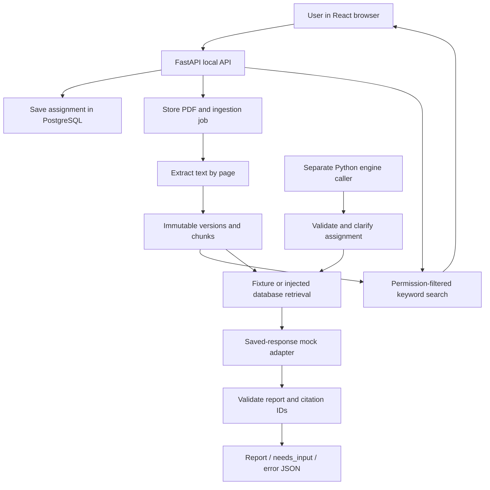

# System and workflows

[Handbook home](README.md)

## Overall flow

The browser, API, database, and engine are separate layers. FastAPI connects the
browser to the data layer. On `main`, callers explicitly invoke the engine from
Python or its CLI; saving an assignment does not generate a report.

## 1. Start the workspace

`setup_local.py` verifies Python and Docker, creates a private local `.env` if
needed, installs pinned Python dependencies, starts PostgreSQL, applies migrations,
and seeds fictional records. The frontend is installed and built separately.
`serve_week2.py` checks for the built frontend, migrates/seeds again safely, enables
local mode, prints a token, and starts FastAPI on `127.0.0.1:8000`.

The API derives a fixed fixture actor and allowed department from server settings;
the browser cannot choose its identity. Every business endpoint checks the bearer
token. The health endpoint is public. A successful health check does not test the
database connection.

## 2. Connect, save, and restore an assignment

1. Enter the launcher's token. `connect()` loads ready documents and upload jobs.
2. The token is stored in `sessionStorage` as `demoToken`. It is not production login.
3. Fill in the problem and intended result, audience, constraints, and required sections.
4. Select immutable document versions that have finished processing.
5. `save()` sends only input-contract fields. The API checks department access and that selected sources are visible and ready.
6. A new assignment UUID, JSON payload, actor, department, and source links are inserted transactionally.
7. The response includes the assignment ID, schema version `2.0`, and creation timestamp.
8. The browser stores the latest ID in `localStorage` as `assignmentId`. Reloading and reconnecting fetches that saved assignment.

Each save creates a new assignment. There is no update/list/delete assignment
endpoint. Unsaved changes exist only in React state. On `main`, the UI does not
send `request_type`, so the API defaults it to `problem` even though direct API
clients can send `RFP` or `RFQ`.

## 3. Upload and process a PDF

1. The browser sends multipart `file` and JSON-string `metadata`.
2. The API checks metadata and MIME type, reads at most the configured limit plus one byte, and determines outbound-model approval itself.
3. `submit_pdf()` checks department membership, the byte limit, and the `%PDF-` signature; it stores a document and a durable `pending` job containing raw bytes.
4. After submission commits, a background task uses a fresh database connection to process the job.
5. `process_job()` marks it `processing`. `extract_chunks()` reads pages, rejecting encrypted, scanned/empty, oversized, or unreadable input.
6. Successful extraction creates a version and page-linked chunks, then marks the job `ready`. An extraction failure marks it `failed` with an error code.
7. The UI polls every two seconds and offers ready, accessible versions for selection.

Defaults: 10 MiB upload size, at most 100 pages, 500,000 extracted characters,
and chunks at most 1,200 characters. Chunks never cross page boundaries. There
is no OCR fallback. One empty/scanned page rejects the whole PDF rather than
quietly dropping that page.

For an existing `document_id`, only its owner in the matching department can add
a version. Identical content, metadata (excluding `document_id`), and extraction
version reuse the latest immutable version. Changed content or metadata creates
a new version. Document locking serializes concurrent version creation. Old
versions and chunks cannot be updated or deleted through ordinary SQL because
append-only triggers reject those operations.

Jobs are durable, but the background runner is an in-process task, not a separate
queue service. After an interruption, stop the API and run the explicit recovery
script. Failed jobs are terminal; corrected input needs another upload.

## 4. Search evidence

`search()` extracts unique word tokens, builds a parameterized English full-text
OR query, filters permitted departments/ready versions/access status/outbound
permission/selected versions, then ranks by `ts_rank_cd`. Equal scores are ordered
by chunk ID. It returns up to the requested limit and records every search,
including empty results, in `search_runs`.

A result contains source title/URI, version and chunk IDs, text, page/locator,
hash, access flags, and score. No match returns `evidence_gap` and an empty list,
not generated text. This is keyword retrieval; semantic similarity and embeddings
are not implemented.

At the search API, `selected_document_version_ids: null` searches all eligible
versions; `[]` searches none. The UI and database engine adapter translate an
empty assignment selection to `null`. This distinction matters when calling the
API directly.

## 5. Import and analyze payments

`week2_cli import-csv` accepts CSV bytes plus a source manifest. The importer checks
exact headers, resolves vendor/department identities conservatively, validates
USD amounts with `Decimal`, verifies any engagement match, and stages each row.
Duplicate transaction identities within one file are rejected together. A source
key plus transaction ID identifies a payment; without a transaction ID, a
conservative hash is used and ambiguous corrections require review.

One transaction stores the source bytes/manifest and each row's outcome. New rows
insert payments; explicit-ID corrections update the current payment and append a
revision; identical rows are unchanged. Rejected rows retain their raw values and
reason. Valid rows can commit even when other rows are rejected; the CLI then
returns exit code 2.

`spending()` groups current payments into consulting, operational, and unresolved
amounts for one department, source population, inclusive date range, and currency.
The supplied budget must match that scope and be positive. The consulting share
is consulting total / budget × 100, rounded to two decimals. Refunds are negative
amounts. The fictional Week 2 population totals $280 consulting, $500 operational,
$50 unresolved, and 2.80% of $10,000. This is separate from Week 1's $300 fixture.

## 6. Run the main-branch consulting engine

1. `validate_assignment()` parses an engine `Assignment` (different from HTTP `AssignmentInput`).
2. `check_scope()` asks for missing intended result/department and RFQ constraints before calling a model.
3. Retrieve the two fixed fixture chunks by default (this fixture helper ignores assignment filters), or explicitly inject `DataEvidenceRepository(connection, context)`.
4. The database adapter scopes to the assignment department, requests only externally approved evidence, removes duplicate text hashes, and caps whole-chunk context at 6,000 characters by default.
5. If no evidence remains, return `needs_input` with `eligible_evidence` missing and no new model call.
6. `MockModelAdapter` loads a saved JSON report, replaces its assignment ID, and records approximate word-based usage. It does not generate new prose or contact an LLM.
7. `validate_report()` checks the report shape, section-to-citation references, and citation-to-retrieved-chunk references.
8. Return `report`, `needs_input`, or `error`.

The main-branch validator does not enforce that every requested section was
returned; that check is added by Jai's newer demo pipeline. A database adapter
also needs a model adapter whose citation IDs match its retrieved UUIDs; the
fixed Week 1 report cannot automatically cite arbitrary uploaded sources.
