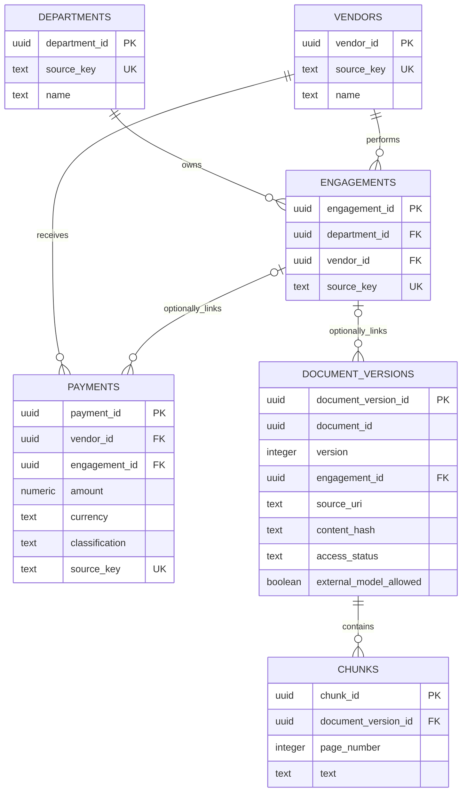

# Schema and data dictionary

The six domain tables separate organizations, work, financial transactions, and
source evidence. `schema_migrations` is an additional bookkeeping table.
The executable definition is `backend/data/migrations/001_initial.sql`.

## Conventions

Every field below is required unless marked **nullable**. UUIDs are internal
record identities. `source_key` is a stable, unique identifier supplied by the
source; future importers must namespace it by source system. The seed's source
keys and amounts are declared in `tests/fixtures/data_week1.json`.
Names/titles/source references must not be blank. No cascading deletion is used.

JSON represents IDs and exact money as strings. Source dates use ISO `YYYY-MM-DD`.
The migration timestamp is stored as `TIMESTAMPTZ`; evidence timestamps use UTC.

## departments

One row represents the department responsible for an engagement.

- `department_id` — `UUID`, primary key; assigned internal ID from the fixture.
- `source_key` — `TEXT`, unique; original department identifier from the source.
- `name` — `TEXT`; department display name from the source.
- `source_uri` — `TEXT`; origin reference, currently a fictional `fixture://` URI.

## vendors

One row represents a firm that receives payments or performs an engagement.

- `vendor_id` — `UUID`, primary key; assigned internal ID from the fixture.
- `source_key` — `TEXT`, unique; original vendor identifier from the source.
- `name` — `TEXT`; firm display name from the source.
- `source_uri` — `TEXT`; origin reference from the source manifest/fixture.

Vendor identity does not imply that every payment to that vendor is consulting.
Alias matching and classification review are future importer work.

## engagements

One row represents a defined piece of work by a vendor for a department.

- `engagement_id` — `UUID`, primary key; assigned internal ID from the fixture.
- `source_key` — `TEXT`, unique; source's stable engagement identifier.
- `department_id` — `UUID`, foreign key to departments; sourced ownership link.
- `vendor_id` — `UUID`, foreign key to vendors; sourced performing-firm link.
- `title` — `TEXT`; work description from source evidence.
- `source_uri` — `TEXT`; origin supporting the engagement record.

The `(engagement_id, vendor_id)` pair is unique so a payment cannot refer to this
engagement while naming a different vendor. Unknown vendor/department ownership
must be resolved before creating an engagement under this initial schema.

## payments

One row represents an actual transaction, including a possible negative refund.

- `payment_id` — `UUID`, primary key; assigned internal ID.
- `source_key` — `TEXT`, unique; stable, source-qualified transaction identifier.
- `vendor_id` — `UUID`, foreign key to vendors; recipient identified by source.
- `engagement_id` — `UUID`, **nullable**; documented link to work. Null means the
  engagement is unknown; the seed links both payments to its known engagement.
- `amount` — `NUMERIC(18,2)`; exact signed amount in currency units, from source.
  Negative refunds are permitted; `NaN` is rejected. PostgreSQL rounds input with
  more than two decimal places, so the future importer must validate precision
  before insertion. Week 1 fixture amounts already have two decimal places.
- `currency` — `TEXT`; required uppercase three-letter currency code, `USD` in
  the fixture. The pattern validates shape, not membership in a currency registry.
- `paid_on` — `DATE`; source payment date. Fiscal-period rules are not yet coded.
- `classification` — `TEXT`; consulting, operational, or unresolved; default
  unresolved. The fixture supplies consulting explicitly.
- `classification_reason` — `TEXT`; source-supported rationale or explanation
  of unresolved status, never a blank label.
- `source_uri` — `TEXT`; reference identifying the original transaction.

Both the vendor FK and composite engagement/vendor FK are enforced. A null
engagement does not bypass the requirement for an existing vendor. Deduplication
uses transaction identity, not amount/date/name; equal amounts can be legitimate.

## document_versions

One row identifies a particular source document version and its provenance.
No document rows are inserted by the Week 1 seed.

- `document_version_id` — `UUID`, primary key; assigned immutable version ID.
- `document_id` — `UUID`; assigned logical document identity grouping versions.
- `version` — `INTEGER`; positive local version number; `(document_id, version)`
  is unique. Version sequencing is the future ingestion service's responsibility.
- `engagement_id` — `UUID`, **nullable**, FK to engagements; only set when known.
- `title` — `TEXT`; source title.
- `issuer` — `TEXT`, **nullable**; source publisher/issuer, unknown until identified.
- `published_on` — `DATE`, **nullable**; source publication date, not upload date.
- `source_uri` — `TEXT`; origin or storage reference for that specific version.
- `content_hash` — `TEXT`; SHA-256 of original bytes, 64 lowercase hexadecimal
  characters. Week 2 extraction must compute and verify it; SQL checks its shape.
- `extraction_version` — `TEXT`, **nullable**; extractor/configuration identifier;
  null means no extraction recorded.
- `access_status` — `TEXT`; unknown, public, or restricted; defaults to unknown.
- `external_model_allowed` — `BOOLEAN`; a separate explicit data-use decision,
  default false. True is invalid while access status is unknown.

Updates/deletes are rejected by an append-only trigger. Changed content or
extraction gets a new version. This is a Week 1 provenance foundation, not a
complete permission/retention system. Later work must separate mutable access
policy from immutable source content so permission revocation remains possible.
No source download, search, or model endpoint exists in this module yet.

## chunks

One row represents an extracted passage from one exact document version.
The Week 1 seed inserts no chunks; extraction is Week 2 work.

- `chunk_id` — `UUID`, primary key; assigned passage ID.
- `document_version_id` — `UUID`, FK to document_versions; extraction's parent.
- `ordinal` — `INTEGER`; zero-based passage position within its version, unique
  per version and nonnegative.
- `page_number` — `INTEGER`; one-based PDF page locator, positive.
- `text` — `TEXT`; nonblank extracted passage.
- `content_hash` — `TEXT`; SHA-256 of passage text, 64 lowercase hexadecimal
  characters. The importer, not the database, will compute the hash.

Updates/deletes are rejected. A chunk cannot point to a missing version.
This initial locator represents a passage on one page; future chunking must keep
page boundaries or extend the contract for multi-page passages.

## schema_migrations

One row records an applied migration. Created by `backend/data/db.py` before the
domain migration runs.

- `version` — `TEXT`, primary key; SQL filename supplied by the migration runner.
- `sha256` — `TEXT`; SHA-256 computed from that file's exact bytes.
- `applied_at` — `TIMESTAMPTZ`; database-generated application time.

The runner locks migration execution, checks history, and applies pending SQL
and the ledger insert within a transaction. If SQL fails, its changes roll back.
Create a new numbered migration when the schema changes; never rewrite history.

## Technical references

- [PostgreSQL exact numeric types](https://www.postgresql.org/docs/17/datatype-numeric.html)
  explains why decimal money is appropriate and documents scale rounding.
- [PostgreSQL INSERT and ON CONFLICT](https://www.postgresql.org/docs/17/sql-insert.html)
  describes the insert-once behavior used by the seed.
- [Psycopg transactions](https://www.psycopg.org/psycopg3/docs/basic/transactions.html)
  explains transaction contexts and nested savepoints used in failure tests.
